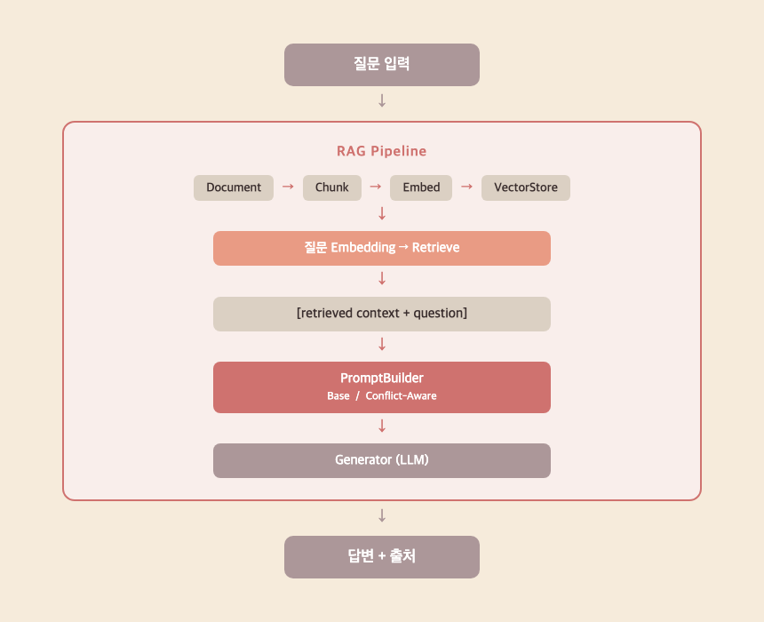
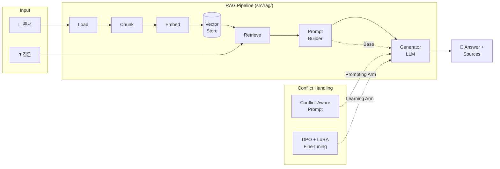
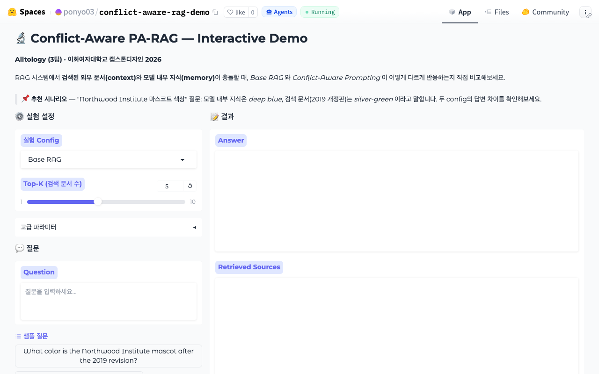
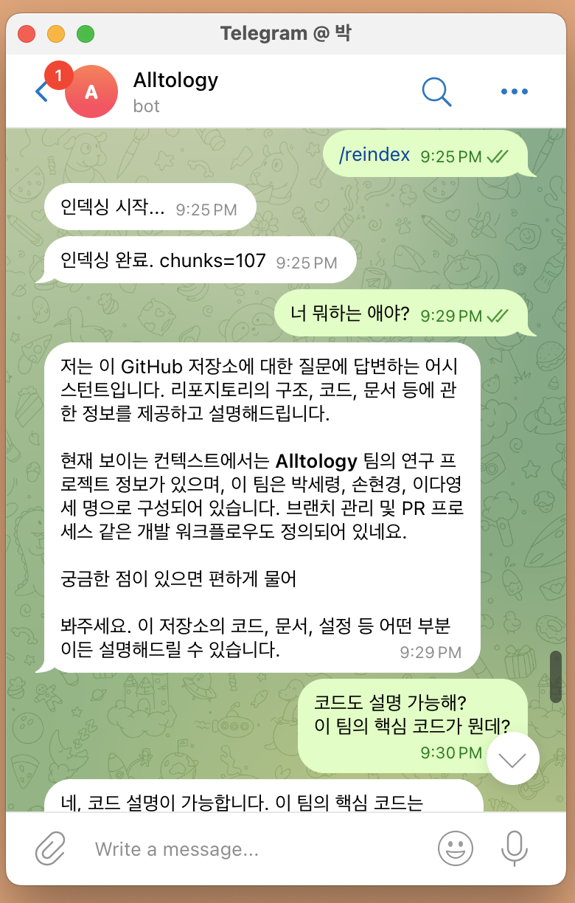
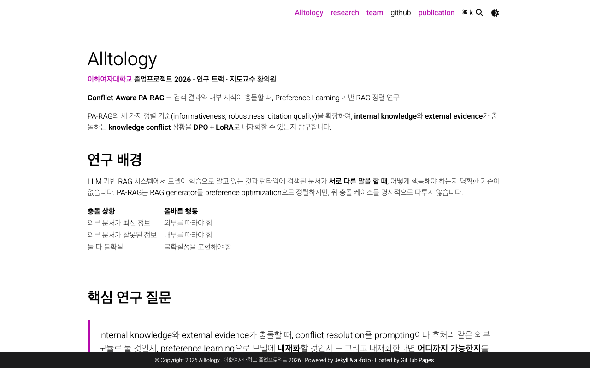

<div align="center">

# 검색 결과와 내부 지식이 충돌할 때
## Conflict-Aware PA-RAG

*RAG에서 발생하는 Knowledge Conflict를 Preference Learning으로 해결하는 연구*

<br/>

[](https://youtu.be/qc0GkgJoBBk)
[](https://huggingface.co/spaces/ponyo03/conflict-aware-rag-demo)
[](http://alltology.zapto.org)
[](https://t.me/alltology_rag_bot)

<br/>

**2026 이화여자대학교 캡스톤디자인 · 03팀 Alltology · 연구 트랙 · 지도교수: 황의원 교수님**

</div>

---

## Why

> AI가 검색한 문서와 자신이 학습한 지식이 다른 말을 할 때, 어느 쪽을 믿어야 할까?

기업 내부 문서 검색 시스템, 법률 정보 RAG, 의료 가이드라인 챗봇 — 이런 시스템에서 AI가 **오래된 내부 지식을 고집하거나**, 반대로 **신뢰할 수 없는 검색 결과를 맹신**하면 치명적인 오답이 나온다.

이 문제는 단순히 "더 좋은 모델"로 해결되지 않는다. **충돌 상황에서 어떤 근거를 우선할지** 모델이 학습으로 내재화해야 한다.

<br/>

## Problem

RAG(Retrieval-Augmented Generation)는 외부 문서를 검색해 LLM 답변의 정확성을 높이는 방식이다. 그러나 **검색된 문서와 LLM 내부 지식이 서로 다른 답을 가리킬 때** 문제가 생긴다.

| 충돌 상황 | 바람직한 행동 | 현재 RAG의 문제 |
|---|---|---|
| 외부 문서가 최신·권위 정보 | 외부 근거 우선 | 모델이 내부 지식 고집 |
| 외부 문서가 부정확·모호 | 내부 지식 또는 불확실성 표현 | 외부 문서 맹신 |
| 둘 다 불확실 | abstention / 한계 명시 | 확신 있는 오답 |

**실제 사례:** 사내 RAG 시스템에서 직원이 재택근무 정책을 질문할 때, AI가 2024년 개정 문서 대신 학습 당시의 구버전 정책을 답하는 상황이 대표적이다.

기존 PA-RAG(Preference-Aligned RAG)는 informativeness·robustness·citation quality를 다루지만, **context–memory conflict를 명시적 정렬 축으로 다루지 않는다** — 본 연구의 출발점.

<br/>

## Solution

DPO(Direct Preference Optimization) + LoRA로 **Knowledge Conflict 처리 능력을 모델에 학습으로 내재화**한다.

| # | 방법 | 학습 | 역할 |
|---|-----|:----:|------|
| 1 | Base RAG | — | 하한선 |
| 2 | **Conflict-Aware Prompting** | — | 프롬프트만으로 충돌 처리 |
| 3 | PA-RAG-style LoRA | DPO + LoRA | conflict 없이 PA-RAG식 정렬 |
| 4 | Conflict-Aware RAG LoRA | DPO + LoRA | conflict preference만 학습 |
| 5 | **Conflict-Aware PA-RAG LoRA** ⭐ | DPO + LoRA | PA-RAG + conflict 통합 (제안 방법) |

**핵심 주장:** 프롬프트 수준의 conflict-aware 지시는 효과가 있으나(파일럿 결과 참조), preference learning으로 내재화하면 더 강건하고 일반화 가능한 conflict 처리가 가능할 것으로 가설 설정.

### 연구 단계

> 본 프로젝트는 **Start 트랙**으로 진행 중입니다.

| 단계 | 내용 | 상태 |
|------|------|:----:|
| **Start** (이번 학기) | Knowledge Conflict 문제 정의 · Base RAG vs Conflict-Aware Prompting 파일럿 실험 · 문제 존재 및 개선 가능성 검증 | ✅ 완료 |
| **Growth** (확장 방향) | Llama 3.1-8B 기반 DPO + LoRA 내재화 · 정량 벤치마크 (ClashEval, WikiContradict) | 🔄 진행 예정 |

<br/>

## 🔬 RAG Pipeline

<p align="center">
  
</p>



<br/>

## 🧪 파일럿 실험 결과

> API 모델(gpt-4o-mini, claude-haiku) 기반 파일럿. 본 연구 타겟인 **Llama 3.1-8B** 실험의 사전 탐색 단계. 상세: [`experiments/2026-05-31/`](experiments/2026-05-31/)

**exp1 — 거짓 문서 거부율** (gpt-4o-mini, 24케이스)

| Arm | 전체 | 거짓 문서 거부 |
|-----|:----:|:------------:|
| Base RAG | 75% | 3 / 6 |
| Conflict-Aware Prompting | **100%** | **6 / 6** |

**exp2 — 문서 구성별 분해** (claude-haiku, 36케이스)

| 문서 구성 | Base RAG | Conflict-Aware |
|----------|:--------:|:--------------:|
| A: 거짓만 (정답 없음) | 50% | **83%** |
| B: 거짓 + 정답 공존 | 100% | 100% |

**핵심 발견:** 강한 API 모델은 temporal conflict를 프롬프트 없이도 ~100% 처리 (천장 효과). → **Llama 3.1-8B에서 gap이 존재할 것으로 예상** — 본 연구의 핵심 측정 구간.

파이프라인 실행 결과물: [`outputs/runs/`](outputs/runs/)

<br/>

## 🛠 Tech Stack

**AI / 학습**


-8A2BE2?style=flat-square)
-412991?style=flat-square)
-0467DF?style=flat-square)

**RAG / 검색**


**데모 / 배포**


<br/>

## 🚀 Quickstart

> 설치 없이 바로 체험하려면 → **[📋 Self-Demo 가이드](self_demo.md)** 를 따라하세요.

[](self_demo.md)

<div align="center">

<br/><sub>🤗 HuggingFace Spaces — Base RAG vs Conflict-Aware Prompting 실시간 비교</sub>
</div>

<br/>

<div align="center">

&nbsp;&nbsp;&nbsp;

<br/><sub>✈️ 텔레그램 RAG 봇 &nbsp;&nbsp;&nbsp;&nbsp;&nbsp;&nbsp;&nbsp;&nbsp;&nbsp;&nbsp;&nbsp;&nbsp;&nbsp;&nbsp;&nbsp;&nbsp;&nbsp;&nbsp;&nbsp;&nbsp;&nbsp;&nbsp;&nbsp;&nbsp;&nbsp;&nbsp;&nbsp;&nbsp;&nbsp;&nbsp;&nbsp;&nbsp;&nbsp;&nbsp;&nbsp;&nbsp;&nbsp; 🌐 연구 사이트 alltology.zapto.org</sub>
</div>

<br/>

| 방법 | 링크 | 설명 |
|------|------|------|
| 🌐 연구 사이트 | [alltology.zapto.org](http://alltology.zapto.org) | 연구 소개 · 팀 정보 |
| 🤗 인터랙티브 데모 | [HuggingFace Spaces](https://huggingface.co/spaces/ponyo03/conflict-aware-rag-demo) | Base RAG vs Conflict-Aware 실시간 비교 |
| ✈️ 텔레그램 봇 | [@alltology_rag_bot](https://t.me/alltology_rag_bot) | 저장소 문서 기반 RAG 챗봇 |
| 🎬 데모 영상 | [youtu.be/qc0GkgJoBBk](https://youtu.be/qc0GkgJoBBk) | 전체 시연 영상 |
| 📊 발표 슬라이드 | [Google Slides](https://docs.google.com/presentation/d/1mxabIcWOkVXfYbtppBo_TeJ6ah2Be-5RHgmoqRcUIaw/edit?usp=sharing) · [PDF](docs/presentation/presentation.pdf) · [Marp 원본](docs/presentation.md) | 기말 발표 자료 |

**로컬 실행:**

> **Step 1** — 레포 클론 및 의존성 설치

```bash
git clone https://github.com/Ontology0/Graduation-Project.git
cd Graduation-Project
pip install -r requirements.txt
```

> **Step 2** — 환경변수 설정 (HuggingFace 모델 사용 시 API 키 불필요)

```bash
cp .env.example .env   # 필요 시 ANTHROPIC_API_KEY 등 입력
```

> **Step 3** — 파이프라인 실행

```bash
make demo          # Base RAG smoke test
make demo-conflict # Base RAG vs Conflict-Aware 비교
```

<br/>

## 📖 Deep into Research

연구 설계와 구현의 상세 내용을 담은 문서입니다.

| 문서 | 내용 |
|------|------|
| [🏗 Architecture](docs/architecture.md) | 시스템 구조 · 데이터 흐름 · 핵심 엔트리포인트 1페이지 요약 |
| [🎬 Demo & Evidence](docs/demo.md) | CLI smoke test · 실제 실행 결과 · 파이프라인 동작 증빙 |
| [✅ Verification Checklist](docs/verification_checklist.md) | 재현성 · 보안 · 운영 항목별 검증 기록 |
| [🤖 AI 투명성 리포트](docs/ai_transparency_report.md) | AI 도구 활용 내역 · 인간 판단 영역 명시 |
| [🗺 RQ ↔ 구현 매핑](docs/rq_to_implementation_map.md) | 연구 질문과 실제 코드의 1:1 대응 관계 |
| [🔬 실험 설계](docs/experiment_design.md) | 5개 arm 비교 설계 · 데이터셋 · 평가 메트릭 |
| [📚 관련 연구](docs/related_work.md) | PA-RAG · DPO · Knowledge Conflict 선행 연구 |
| [📋 Project Brief](course/elevator_speech_team03.md) | 팀 소개 · 연구 방향 · 가치 제안 요약 |
| [📊 Benchmark selection](docs/benchmark_selection.md) | 벤치마크 후보 검토 및 train/eval split (**#55 반영**) |
| [📝 Decision log](docs/decision_log.md) | 확정·보류·제외 결정 |

벤치마크·데이터셋 전략 요약: **train** = 명확 라벨(버전·시간, true_doc/false_doc, context–memory); **eval** = held-out + 논쟁적(false-only, model_knows) + 자연/토론(WikiContradict 등). 상세는 `docs/benchmark_selection.md`, 근거는 `docs/decision_log.md`.

<br/>

## 🗺 What's Next

| 방향 | 내용 | 기대 효과 |
|------|------|----------|
| **Llama 3.1-8B 실험** | 파일럿에서 확인한 gap을 타겟 모델에서 측정 | conflict 처리 lower bound 확보, DPO 학습 기준선 설정 |
| **DPO 학습 데이터 구축** | synthetic conflict JSONL 확장 + ClashEval 활용 | preference pair 품질이 학습 효과 직결 |
| **LoRA Fine-tuning** | Conflict-Aware PA-RAG LoRA (제안 방법 5번 arm) 학습 | 프롬프트 없이도 충돌 처리 능력 내재화 |
| **정량 벤치마크** | WikiContradict · ClashEval 평가 | 제안 방법의 일반화 성능 검증 |

<br/>

## 📁 저장소 구조

```text
Graduation-Project/
├── src/
│   ├── rag/                      # RAG 파이프라인 (핵심 구현)
│   │   ├── pipeline.py           #   전체 파이프라인 오케스트레이터
│   │   ├── document_loader.py    #   문서 로딩
│   │   ├── github_kb.py          #   GitHub repo KB ingest (Telegram 봇)
│   │   ├── pilot_dataset.py      #   파일럿/배치용 데이터셋 헬퍼
│   │   ├── chunker.py            #   텍스트 청킹
│   │   ├── embedder.py           #   임베딩 생성
│   │   ├── vector_store.py       #   FAISS 벡터 스토어
│   │   ├── retriever.py          #   검색 모듈
│   │   ├── prompt_builder.py     #   프롬프트 빌더
│   │   ├── generator.py          #   LLM 생성 (HF / Anthropic)
│   │   ├── reporting.py          #   실행 결과 JSON/MD 저장 (outputs/runs/)
│   │   └── config.py             #   설정 로더
│   ├── chatbot/
│   │   └── telegram_bot.py       #   텔레그램 RAG 봇 (Railway 배포)
│   ├── training/
│   │   └── train.py              #   DPO + LoRA 학습 (진행 중)
│   └── evaluation/
│       └── evaluate.py           #   평가 파이프라인 (진행 중)
├── scripts/
│   ├── run_pipeline.py           # RAG 파이프라인 실행 CLI
│   ├── run_batch.py              # 배치 실행
│   └── telegram_bot.py           # 텔레그램 봇 엔트리포인트
├── configs/
│   ├── experiments/              # 실험 설정 YAML (rag_base, prompting, lora_*, rag_github_bot)
│   └── prompts/                  # 프롬프트 템플릿 (base_rag, conflict_aware, judge, github_bot)
├── data/
│   ├── schema/                   # conflict·preference JSON Schema
│   ├── sample_docs/              # smoke test용 샘플 문서
│   ├── synthetic_conflicts/      # DPO 학습용 합성 conflict 데이터
│   ├── synthetic/                # 합성 데이터 (예정)
│   └── natural/                  # 자연 conflict 케이스 (예정)
├── experiments/                  # 파일럿 실험 (날짜별 폴더)
│   ├── pilot_2026-05-26/        #   로컬 sanity-check (config·prompt·batch 배선)
│   ├── api_pilot_2026-05-28/    #   GPT-4o-mini API 파일럿
│   └── 2026-05-31/              #   ClashEval 기반 exp1~4
├── outputs/
│   └── runs/                     # 파이프라인 실행 결과물 (JSON / MD)
├── docs/                         # 연구·운영 문서 (architecture, demo, verification 등)
├── course/                       # 수업 제출물 (Project Brief, PMF, 팀 규칙 등)
├── tests/                        # pytest 테스트 스위트
├── app.py                        # HuggingFace Spaces Gradio 데모
├── self_demo.md                  # 방문자용 5분 체험 가이드
├── Makefile                      # make demo / make demo-conflict
├── requirements.txt              # RAG 파이프라인 패키지
├── requirements_bot.txt          # 텔레그램 봇 배포 전용 패키지
├── Procfile                      # Railway 봇 배포 설정
└── railway.json                  # Railway 배포 구성
```

<br/>

## 🤝 기여하기

버그 리포트, 실험 아이디어, 코드 기여 모두 환영합니다.

1. `dev` 브랜치에서 작업 브랜치를 생성합니다 (`feat/`, `fix/`, `docs/` 등)
2. 변경 후 `dev`로 Pull Request를 올립니다
3. 커밋 메시지 형식 · 브랜치 전략 · PR 절차는 [CONTRIBUTING.md](CONTRIBUTING.md) 참고

<br/>

## 🌿 브랜치 전략

```
main  ← 제출 / 배포 스냅샷
  └── dev  ← 일상 개발 · PR 통합
        ├── feat/ · docs/ · chore/ · fix/
```

상세 규칙: [CONTRIBUTING.md](CONTRIBUTING.md)

<br/>

## 👥 팀

|  |  |  |
|:---:|:---:|:---:|
| **박세령** | **손현경** | **이다영** |
| [@ryeong03](https://github.com/ryeong03) | [@bbberylll](https://github.com/bbberylll) | [@dev-ldy03](https://github.com/dev-ldy03) |
| Conflict 설계 · RAG 파이프라인 | DPO 학습 · LoRA fine-tuning | 데이터 파이프라인 · 평가 |

**팀명:** Alltology · **팀 번호:** 03 · **트랙:** 연구 · **지도교수:** 황의원 교수님

**AI 투명성 리포트:** [docs/ai_transparency_report.md](docs/ai_transparency_report.md)

---

<div align="center">

*2026 이화여자대학교 캡스톤디자인*

</div>
