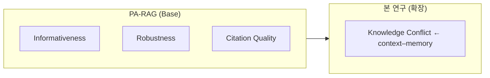

# 검색 결과와 내부 지식이 충돌할 때: Preference Learning 기반 RAG 정렬 연구
## Conflict-Aware PA-RAG

> **주제:** LLM Knowledge Conflict 완화를 위한 RAG–Fine-tuning 융합 연구  
> PA-RAG의 정렬 기준(informativeness, robustness, citation quality)을 확장하여, **internal knowledge와 external evidence가 충돌하는 상황**을 DPO + LoRA로 내재화할 수 있는지 탐구.

<br/>

## 🚀 Demo / Quickstart

- **🌐 데모 사이트**: [alltology.zapto.org](http://alltology.zapto.org) — 연구 소개 · 인터랙티브 실험 · 팀 정보
- **인터랙티브 데모**: [🤗 HuggingFace Spaces](https://huggingface.co/spaces/ponyo03/conflict-aware-rag-demo) — Base RAG vs Conflict-Aware Prompting 실시간 비교
- **✈️ 텔레그램 RAG 봇**: [@alltology_rag_bot](https://t.me/alltology_rag_bot) — 저장소 문서 기반 RAG 챗봇 (README · docs 벡터 검색)
- **데모 영상**: 🎬 [youtu.be/qc0GkgJoBBk](https://youtu.be/qc0GkgJoBBk)
- **발표 자료(슬라이드)**: [Google Slides — 03팀 스타트 기말 발표](https://docs.google.com/presentation/d/1mxabIcWOkVXfYbtppBo_TeJ6ah2Be-5RHgmoqRcUIaw/edit?usp=sharing) · 로컬 PDF: [docs/presentation/presentation.pdf](docs/presentation/presentation.pdf) · Marp 원본: [docs/presentation.md](docs/presentation.md)
- **Project Brief**: [course/elevator_speech_team03.md](course/elevator_speech_team03.md) — 팀 소개·연구 방향 요약
- **Demo 문서**: [docs/demo.md](docs/demo.md) — CLI smoke test + 데모 증빙
- **아키텍처 1페이지 요약**: [docs/architecture.md](docs/architecture.md)
- **검증 체크리스트(재현/보안/운영)**: [docs/verification_checklist.md](docs/verification_checklist.md)
- **RQ ↔ 구현 매핑(정합성)**: [docs/rq_to_implementation_map.md](docs/rq_to_implementation_map.md)
- **AI 투명성 리포트**: [docs/ai_transparency_report.md](docs/ai_transparency_report.md)
- **텔레그램 봇 운영/보안**: [docs/telegram_bot_ops.md](docs/telegram_bot_ops.md)

<br/>

## 저장소 상태

- **This repository is currently a research scaffold.**
- Implementation, training, and evaluation results will be updated progressively.
- **No final experimental results are reported yet.**
- RAG 파이프라인(`src/rag/`)은 **1차 구현 초안**이 준비되어 있으며, 실제 벤치마크 기반 검증은 진행 전입니다. 학습(`src/training/`)·평가(`src/evaluation/`)는 scaffold 단계입니다.
- 벤치마크, 데이터셋, 평가 프로토콜은 **확정 중**입니다. 상세 초안은 `docs/`를 참고.

<br/>

## 연구 범위

본 연구는 knowledge conflict 중에서도 **context–memory conflict**를 다룸.

| 용어 | 정의 | 본 연구 |
|------|------|:------:|
| **Context–memory conflict** | RAG에서 검색된 **external context**와 LLM **internal(parametric) knowledge**가 서로 다른 답을 가리키는 상황 | **핵심 범위** |
| Inter-context conflict | 여러 검색 문서·문맥 간 상호 모순 | 메인 연구 대상 **아님** (벤치마크 참고 수준 가능) |
| Intra-memory conflict | 파라미터 지식 내부의 자기 모순 (검색 없이) | 메인 연구 대상 **아님** |

<br/>

## 연구 문제

RAG가 검색 문서를 제공하더라도 LLM이 **내부 지식에 의존해 다른 답**을 생성할 수 있다. 반대로, 신뢰할 수 없는 검색 결과를 맹목적으로 따를 수도 있다.

| 충돌 상황 | 바람직한 행동 | 현재 문제 |
|---|---|---|
| 외부 문서가 최신·권위 정보 | 외부 근거 우선 | 모델이 내부 지식 고집 |
| 외부 문서가 부정확·모호 | 내부 지식 또는 불확실성 표현 | 외부 문서 맹신 |
| 둘 다 불확실 | abstention / 한계 명시 | 확신 있는 오답 |

따라서 **단순 retrieval 성능**뿐 아니라, 충돌 상황에서 **어떤 근거를 우선할지** 학습·평가하는 것이 중요하다. PA-RAG는 informativeness·robustness·citation을 다루지만, 위 **knowledge conflict**를 명시적 정렬 축으로 다루지 않는다 — 본 연구의 확장 지점.

<br/>

## 방법론 개요

아래 다섯 arm을 동일한 retrieval·질문 설정에서 비교하는 것을 목표로 한다 (`docs/experiment_design.md`).

| # | Arm | 학습 | 역할 |
|---|-----|:----:|------|
| 1 | **Base RAG** | 없음 | 기본 RAG 하한선 |
| 2 | **Conflict-aware prompting** | 없음 | 프롬프트만으로 충돌 처리 |
| 3 | **PA-RAG-style LoRA** | DPO + LoRA | conflict 없이 PA-RAG식 정렬 |
| 4 | **Conflict-Aware RAG LoRA** | DPO + LoRA | conflict preference만 학습 |
| 5 | **Conflict-Aware PA-RAG LoRA** | DPO + LoRA | PA-RAG 단계 + conflict (**제안 방법**) |

설정 파일: `configs/experiments/` · 프롬프트: `configs/prompts/` · 데이터 스키마: `data/schema/`

> **Full FT reference:** 자원 한계로 PA-RAG 원문의 full fine-tuning은 재현하지 않고, 필요 시 논문 수치를 **인용 비교**로만 활용.

<br/>

## 🧭 프로젝트 개요

RAG generator를 preference optimization으로 정렬하는 **PA-RAG**를 base로 삼고, **DPO + LoRA**로 학부 수준 자원에서 실험 가능성을 확보. Conflict resolution을 **prompting/후처리**에 둘지 **preference learning으로 내재화**할지, 내재화한다면 **어디까지 가능한지**를 탐구.

<br/>

## 💡 핵심 연구 질문

1. Preference learning으로 conflict resolution을 **내재화**할 수 있는가?
2. 어떤 conflict pattern은 학습되고 어떤 것은 한계인가?
3. **Prompting** 대비 **LoRA 내재화**는 얼마나 효과적인가? (프로토콜 확정 후 측정)
4. Conflict 정렬이 informativeness 등 다른 축을 해치지 않는가?

<br/>

## 🔬 PA-RAG와의 관계



| 기준 | PA-RAG | 본 연구 |
|---|---|:---:|
| Informativeness | ✅ | ✅ (비교·확장) |
| Robustness | ✅ | ✅ |
| Citation Quality | ✅ | ✅ |
| **Knowledge Conflict (context–memory)** | ❌ | ✅ |

<br/>

## 📚 문서 및 벤치마크

| 문서 | 내용 |
|------|------|
| `course/elevator_speech_team03.md` | **Project Brief** — 팀 소개·연구 방향·문제 정의 요약 |
| `docs/research_plan.md` | 문제 정의, RQ, 기여, 한계 (상세) |
| `docs/related_work.md` | 관련 논문 citation placeholder |
| `docs/benchmark_selection.md` | ClashEval, ConflictBank 등 후보 (**final decision pending**) |
| `docs/experiment_design.md` | 비교군 상세 |
| `docs/decision_log.md` | 확정·보류·제외 결정 |
| `course/` | 수업 제출물 (elevator speech, PMF, PA-RAG 독서 노트 등) |

벤치마크·데이터셋 전략 요약(확정 전): ClashEval·ConflictBank(학습 후보), WikiContradict(평가·자연 conflict), CONFLICTS/DRAGged(스키마 참고) — 상세는 `docs/benchmark_selection.md`.

<br/>

## 🛠 기술 스택

### AI / 학습

| 역할 | 기술 |
|------|------|
| Preference Learning | DPO (TRL) |
| 경량 Fine-tuning | LoRA / PEFT |
| 런타임 | PyTorch, Hugging Face `transformers` |

### RAG / 검색

| 역할 | 기술 | 비고 |
|------|------|------|
| Baseline local vector store | **FAISS** or **Chroma** | 스캐폴드 단계 후보; `requirements.txt`에 FAISS만 명시 |
| Scalable retrieval backend (후보) | **OpenSearch** | 대규모·분산 검색 후보 — **미확정**, 의존성 주석 처리 |

### 평가

| 역할 | 기술 | 비고 |
|------|------|------|
| 자동 평가 | RAGAS 등 | 프로토콜 **TBD** |
| 정성 평가 | LLM-as-a-judge (`configs/prompts/judge.md`) | 루브릭 초안만 존재 |

의존성 목록: `requirements.txt` (스캐폴드에 필요한 최소 패키지; 미사용 무거운 패키지는 TODO 주석).

<br/>

## ▶️ 실행

```bash
# 의존성 설치
pip install -r requirements.txt
# 또는 한 번에: make install

# RAG 파이프라인 실행 (원커맨드)
make demo                # Base RAG smoke test
make demo-conflict       # Base RAG vs Conflict-Aware 비교

# 직접 실행
python scripts/run_pipeline.py \
    --config configs/experiments/rag_base.yaml \
    --docs data/sample_docs/ \
    --question "What is knowledge conflict in RAG?"

# Telegram 프로젝트 공유용 RAG 봇 (로컬 실행)
# - 봇 이름/초대 링크는 README에 적지 않음 (스팸/비용 위험)
# - 설정/프롬프트/인덱싱 범위는 YAML로 관리
python scripts/telegram_bot.py \
    --config configs/experiments/rag_github_bot.yaml \
    --verbose

# Fine-tuning (scaffold)
python -m src.training.train

# Evaluation (scaffold)
python -m src.evaluation.evaluate
```

<br/>

## 🤖 Telegram 프로젝트 공유용 RAG 봇

이 텔레그램 봇은 GitHub 저장소의 `README.md`, `docs/`, `CLAUDE.md`를 지식베이스로 사용하고, 문서를 청킹·임베딩한 뒤 벡터 검색으로 관련 문맥을 찾고, 해당 문맥을 프롬프트에 삽입하여 Claude가 답변을 생성하는 **RAG 기반 챗봇**입니다.

저장소의 문서 기반으로 **프로젝트 소개·실행 방법·문서 위치·코드 위치(경로/라인)** 같은 질문에 답하는 용도입니다. (코드를 통째로 복사해서 던지는 형태는 지양)

- **구현 위치**: `src/chatbot/telegram_bot.py` (로직), `scripts/telegram_bot.py` (실행 엔트리포인트)
- **설정 위치**: `configs/experiments/rag_github_bot.yaml`, `configs/prompts/github_bot.md`
- **필수 환경변수(예시)**: `.env.example` 참고
- **운영/보안/비용**: `docs/telegram_bot_ops.md` 참고

### 주요 커맨드

- **`/about`**: 프로젝트 소개(README 기반)
- **`/run`**: 로컬 실행 방법 요약
- **`/where <키워드>`**: 저장소에서 키워드 위치 찾기(경로/라인)
- **`/sources`**: 최근 답변의 출처(상위 k) 보기
- **`/save`**: 최근 답변을 `outputs/`에 저장 + 파일 전송(민감)
- **`/reindex`**: 문서 재인덱싱(민감)

### 운영/보안 옵션(권장)

- **화이트리스트**: `TELEGRAM_ALLOWED_USER_IDS=...` 로 허용 사용자만 접근
- **레이트리밋**: `TELEGRAM_RATE_LIMIT_PER_MIN=...`
- **메시지 길이 분할**: `TELEGRAM_MAX_MESSAGE_CHARS=...` (텔레그램 길이 제한 대응)

## 📁 저장소 구조

```text
Graduation-Project/
├── src/                          # 소스 코드
│   ├── rag/                      # RAG 파이프라인
│   │   ├── config.py             #   설정 로더
│   │   ├── document_loader.py    #   문서 로딩
│   │   ├── chunker.py            #   텍스트 청킹
│   │   ├── embedder.py           #   임베딩 생성
│   │   ├── vector_store.py       #   FAISS 벡터 스토어
│   │   ├── retriever.py          #   검색 모듈
│   │   ├── prompt_builder.py     #   프롬프트 빌더
│   │   ├── generator.py          #   LLM 생성
│   │   └── pipeline.py           #   전체 파이프라인 오케스트레이터
│   ├── chatbot/                  # 챗봇 로직
│   │   └── telegram_bot.py       #   텔레그램 RAG 봇
│   ├── training/                 # DPO + LoRA 학습
│   │   └── train.py
│   └── evaluation/               # 평가 파이프라인
│       └── evaluate.py
├── configs/
│   ├── experiments/              # 실험 설정 YAML
│   └── prompts/                  # 프롬프트 템플릿
├── data/
│   ├── schema/                   # conflict·preference JSON Schema
│   ├── sample_docs/              # smoke test용 샘플 문서
│   ├── synthetic/                # DPO 학습용 synthetic conflict
│   └── natural/                  # natural conflict case study
├── scripts/
│   ├── run_pipeline.py           # RAG 파이프라인 실행
│   └── telegram_bot.py           # 텔레그램 봇 엔트리포인트
├── tests/
├── docs/                         # 연구·운영 문서
├── course/                       # 수업 제출물
├── outputs/                      # 실험 산출물
├── app.py                        # HuggingFace Spaces Gradio 데모 엔트리포인트
├── self_demo.md                  # 평가자·방문자용 5분 체험 가이드
├── .env.example                  # 환경변수 템플릿 (API 키·토큰)
├── pyproject.toml
├── requirements.txt              # RAG 파이프라인·학습 패키지
├── requirements_bot.txt          # Telegram 봇 배포 전용 패키지 (Railway)
├── Procfile                      # Railway 봇 배포 프로세스 정의
├── railway.json                  # Railway 배포 설정
├── vercel.json                   # Vercel 데모 사이트 배포 설정
├── CNAME                         # GitHub Pages 커스텀 도메인 (alltology.zapto.org)
├── index.html                    # GitHub Pages 연구 소개 페이지
└── README.md
```

### 처음 보는 사람을 위한 읽는 순서

1. 본 README **저장소 상태**와 `docs/decision_log.md`
2. `docs/research_plan.md`, `docs/experiment_design.md`
3. `data/schema/`, `configs/prompts/`, `configs/experiments/`
4. `src/rag/pipeline.py` → 각 모듈 순서대로
5. 벤치마크 확정 후 `data/`, `src/evaluation/`, `outputs/` 채움

<br/>

## 🌿 브랜치 전략

상세 규칙·커밋 메시지·PR 절차는 [CONTRIBUTING.md](CONTRIBUTING.md)를 따릅니다.

```
main ← 최종 제출 / 배포용
  └── dev ← 일상 개발 / PR 통합용
        ├── feat/data/설명
        ├── feat/dpo/설명
        ├── feat/rag/설명
        ├── feat/eval/설명
        ├── docs/설명
        ├── chore/설명
        └── fix/설명
```

**일상 작업:** `dev`에서 작업 브랜치 생성 → `dev`로 PR → 리뷰 후(1개 이상) merge

**`main` 반영:** 마일스톤·제출·데모 전 등 팀 합의 시점에만 `dev` → `main` PR (작업 브랜치는 `main`으로 직접 PR하지 않음)

<br/>

## 👥 팀

**팀명:** Alltology · **팀 번호:** 03 · **트랙:** 연구 · **지도교수:** 황의원 교수님

|  |  |  |
|:--:|:--:|:--:|
| **박세령** | **손현경** | **이다영** |
| Conflict type 설계 · RAG 파이프라인 | DPO 학습 · LoRA fine-tuning | 데이터 파이프라인 · 평가 |
| [@ryeong03](https://github.com/ryeong03) | [@bbberylll](https://github.com/bbberylll) | [@dev-ldy03](https://github.com/dev-ldy03) |

<br/>

<div align="center">
<sub>이화여자대학교 졸업프로젝트 2026</sub>
</div>
