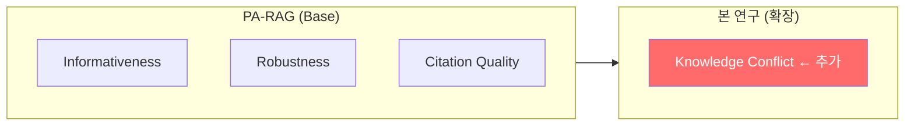
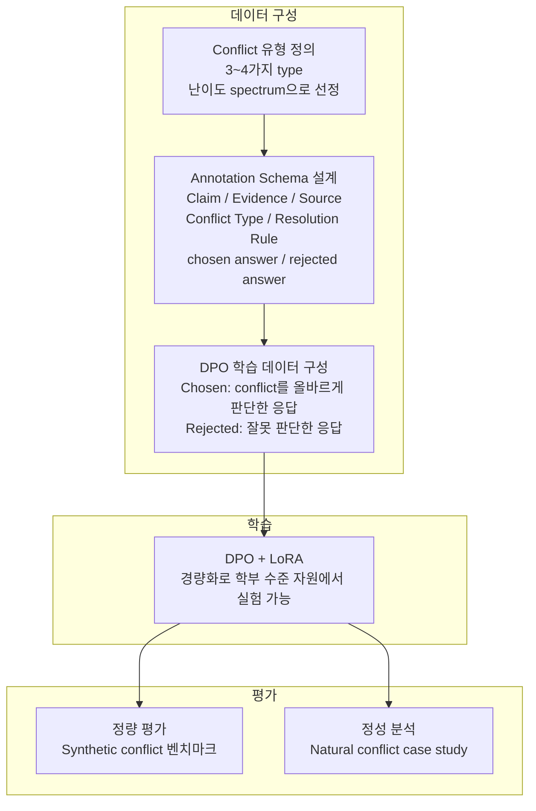
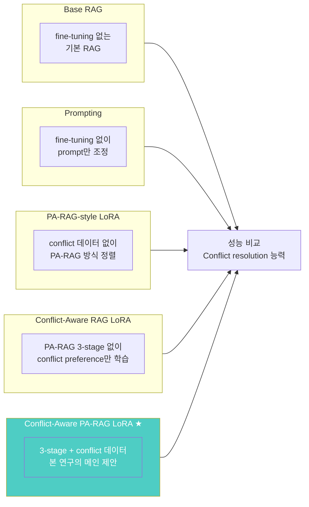

# 검색 결과와 내부 지식이 충돌할 때: Preference Learning 기반 RAG 정렬 연구
## Conflict-Aware PA-RAG

> PA-RAG의 세 가지 정렬 기준(informativeness, robustness, citation quality)을 확장하여,  
> **internal knowledge와 external evidence가 충돌하는 knowledge conflict 상황을 DPO + LoRA로 내재화할 수 있는지 탐구한다**

<br/>

## 저장소 상태 (research scaffold)

이 저장소는 **research scaffold** 단계입니다. 벤치마크, 데이터셋, 평가 프로토콜은 **확정 중**이며, `data/`, `doc/`, `eval/`, `finetuning/`, `rag/`, `results/`에는 각 폴더 목적을 적은 `README.md`가 있습니다. **실제로 실행 가능한 코드는** `rag/pipeline_stub.py`, `finetuning/train_stub.py`, `eval/evaluate_stub.py` **placeholder뿐**이며, 외부 API 호출·학습·점수 산출은 하지 않습니다.

<br/>

## 🧭 프로젝트 개요

RAG(Retrieval-Augmented Generation) 시스템에서 generator를 preference optimization으로 정렬하는 **PA-RAG**를 base 논문으로 삼아, PA-RAG가 다루지 않는 **knowledge conflict** 상황을 네 번째 정렬 기준으로 추가하는 연구입니다.

PA-RAG는 full fine-tuning을 전제로 하여 학부 수준의 자원에서 재현이 어렵습니다. 본 연구는 **DPO + LoRA** 조합으로 실험 환경을 확보하고, conflict resolution 능력을 모델에 내재화할 수 있는지 — 그리고 **어디까지 가능한지** 를 탐구합니다.

<br/>

## 문제의식

LLM 기반 RAG 시스템은 강력하지만, 모델이 학습으로 알고 있는 것(internal knowledge)과 런타임에 검색된 문서(external evidence)가 **서로 다른 말을 할 때** 어떻게 행동해야 하는지 명확한 기준이 없습니다.

| 충돌 상황 | 올바른 행동 | 현재 문제 |
|---|---|---|
| 외부 문서가 최신 정보 | 외부를 따라야 함 | 모델이 내부 지식을 고집 |
| 외부 문서가 잘못된 정보 | 내부를 따라야 함 | 모델이 외부 문서를 맹목적으로 신뢰 |
| 둘 다 불확실 | 불확실성을 표현해야 함 | 모델이 확신하며 틀린 답 생성 |

**PA-RAG는 이 세 케이스를 명시적으로 다루지 않습니다.**

<br/>

## 💡 핵심 연구 질문 (RQ)

> *Internal knowledge와 external evidence가 충돌할 때, conflict resolution을 prompting이나 후처리 같은 외부 모듈로 둘 것인지, preference learning으로 모델에 내재화할 것인지 — 그리고 내재화한다면 어디까지 가능한지를 탐구한다.*

```
내재화한다면 어디까지 가능한지를 탐구한다.
  ├── 단순한 충돌(factual contradiction)은 학습으로 해소할 수 있는가?
  ├── 복잡하거나 미묘한 충돌(다중 source 신뢰도 판단)도 가능한가?
  ├── LoRA 같은 경량 방식으로도 내재화가 되는가?
  └── 내재화했을 때 다른 성능(informativeness 등)이 떨어지지는 않는가?
```

<br/>

## 🔬 PA-RAG와의 관계



| 기준 | 설명 | PA-RAG | 본 연구 |
|---|---|:---:|:---:|
| Informativeness | 답이 충분한 정보를 담는가 | ✅ | ✅ |
| Robustness | 노이즈 문서에 흔들리지 않는가 | ✅ | ✅ |
| Citation Quality | 출처 인용이 정확한가 | ✅ | ✅ |
| **Knowledge Conflict** | **내부 지식 vs 외부 근거 충돌 시 올바르게 판단하는가** | ❌ | ✅ |

<br/>

## 🤖 연구 접근 방법



<br/>

## 🧪 실험 설계



> **Full FT reference**: 자원 한계로 직접 수행하지 못하고 PA-RAG 논문의 수치를 인용 비교군으로 활용합니다.

### 핵심 연구 질문

1. Preference learning으로 conflict resolution을 내재화할 수 있는가?
2. 어떤 conflict type은 학습이 되고 어떤 type은 안 되는가? (한계 매핑)
3. Prompting 방식 대비 내재화 방식은 얼마나 효과적인가?

<br/>

## 📊 PA-RAG 원본 vs 본 연구

| | PA-RAG (원본) | 본 연구 | 비고 |
|---|---|---|---|
| 정렬 기준 | Informativeness, Robustness, Citation | + Knowledge Conflict | **확장 기여** |
| 학습 방식 | Full Fine-tuning | DPO + LoRA | 자원 제약 대응 |
| Conflict 처리 | 미지원 | 명시적 정렬 | **핵심 기여** |
| 비교 방식 | — | Prompting vs Preference learning | 한계 분석 구조 |

<br/>

## 📚 Related Work

| 연구 | 내용 | 본 연구와의 관계 |
|---|---|---|
| PA-RAG | RAG generator를 preference optimization으로 정렬 | Base 논문 |
| Xie et al., ICLR 2024 (Adaptive Chameleon) | LLM이 conflict 상황에서 어떻게 행동하는지 분석 | 행동 분석 기초 |
| Longpre et al., EMNLP 2021 | Entity substitution으로 synthetic conflict 생성 | 데이터 구성 방법론 |
| Jin et al., LREC-COLING 2024 (Tug-of-war) | RAG에서 conflict resolution 방법론 탐구 | 직접 비교 대상 |
| Xu et al., EMNLP 2024 (Survey) | Knowledge conflict 유형 분류 및 기존 연구 정리 | 배경 지식 |
| ClashEval, NeurIPS 2024 | 내부/외부 지식 conflict 수치화 벤치마크 | 학습 + 평가 데이터 |
| ConflictBank, NeurIPS 2024 | Retrieved/embedded conflict 종합 벤치마크 | 학습 데이터 subset |

<br/>

## 📐 데이터셋 전략

| 데이터셋 | 용도 | 이유 |
|---|---|---|
| **ClashEval** | 학습 + 평가 | Ground truth 자명, synthetic conflict, DPO 쌍 구성 가능 |
| **ConflictBank** (retrieved 부분) | 학습 subset | 규모가 커서 학습용 subset 구성에 적합 |
| **WikiContradict** | 평가 (자연 conflict) | 실제 위키피디아 모순 사례 기반 |
| **CONFLICTS / DRAGged** | Resolution rule 설계 참고 | Conflict type 및 expert annotation 구조 참고 |
| **Natural conflict case study** | 정성 분석 | Synthetic과 natural의 분포 차이 분석용 |

> **학습/평가 분리 원칙**: Ground truth가 자명한 synthetic conflict만 학습에 사용하고, 정답이 모호한 자연 conflict는 한계 분석 용도로만 활용합니다.

<br/>

## 🛠 기술 스택

### AI / 학습

| 역할 | 기술 |
|------|------|
| Preference Learning |  |
| 경량화 Fine-tuning |  |
| 개발 환경 |   |
| 테스트 |  |

### RAG 파이프라인

| 역할 | 기술 |
|------|------|
| 검색 |  |
| 벡터 임베딩 |  |

### 평가

| 역할 | 기술 |
|------|------|
| 자동 평가 |  |
| 정성 평가 |  |
| 인간 평가 |  |

### 공통

| 역할 | 기술 |
|------|------|
| 버전 관리 |   |
| 컴퓨팅 |  |

<br/>

## ▶️ 실행 (Placeholder)

| 모듈 | 실행 (placeholder) | 비고 |
|:--:|:--|:--|
| **RAG** | `python rag/pipeline_stub.py` | 인터페이스만; 검색·생성 없음 |
| **Fine-tuning** | `python finetuning/train_stub.py` | 인터페이스만; 학습 없음 |
| **Eval** | `python eval/evaluate_stub.py` | 인터페이스만; 점수 없음 |
| **테스트** | `pytest` | 스캐폴드 단계에서 스위트 미완성 |

<br/>

## 📁 저장소 구조

```text
Graduation-Project/
├── data/          # 학습/평가 데이터셋 (ClashEval, ConflictBank 등)
│   ├── synthetic/ # DPO 학습용 synthetic conflict 데이터
│   └── natural/   # 한계 분석용 natural conflict case study
├── doc/           # 연구 문서, 설계 초안, 회의·결정 기록
├── eval/          # 평가 스크립트 (conflict resolution 정확도, RAGAS 등)
├── finetuning/    # DPO + LoRA 학습 코드
│   ├── dpo/       # DPO 학습 스크립트
│   └── lora/      # LoRA 어댑터 설정
├── rag/           # Base RAG 파이프라인
├── results/       # 실험 산출물 (날짜별 폴더)
├── .env.example
├── CNAME
├── index.html     # GitHub Pages 프로젝트 페이지
├── README.md
├── CLAUDE.md
└── requirements.txt
```

### 처음 보는 사람을 위한 읽는 순서

1. 위 **저장소 상태**와 각 폴더 `README.md`로 스캐폴드 범위를 확인한다.
2. `rag/pipeline_stub.py`, `finetuning/train_stub.py`, `eval/evaluate_stub.py`로 향후 코드 진입점 형태만 본다.
3. 벤치마크와 프로토콜이 확정되면 `data/`, `eval/`, `results/`가 채워진다.

<br/>

## 🌿 브랜치 전략

```
main ← 최종 제출 / 논문 기준
 └── dev ← 통합 개발 (PR 타겟)
      ├── feat/data/#이슈번호-설명        (데이터셋 구성)
      ├── feat/dpo/#이슈번호-설명         (DPO 학습)
      ├── feat/rag/#이슈번호-설명         (RAG 파이프라인)
      ├── feat/eval/#이슈번호-설명        (평가 스크립트)
      └── fix/#이슈번호-설명
```

<br/>

## 👥 팀

**팀명:** Alltology · **트랙:** 연구 · **지도교수:** 황의원 교수님

|  |  |  |
|:--:|:--:|:--:|
| **박세령** | **손현경** | **이다영** |
| Conflict type 설계 · RAG 파이프라인 | DPO 학습 · LoRA fine-tuning | 데이터 파이프라인 · 평가 |
| [@ryeong03](https://github.com/ryeong03) | [@bbberylll](https://github.com/bbberylll) | [@dev-ldy03](https://github.com/dev-ldy03) |

<br/>

<div align="center">
<sub>이화여자대학교 졸업프로젝트 2026</sub>
</div>
