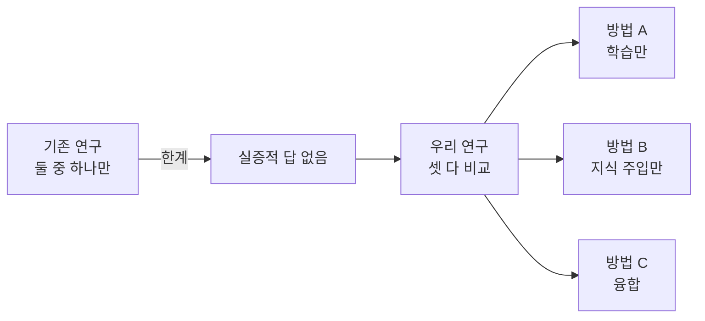
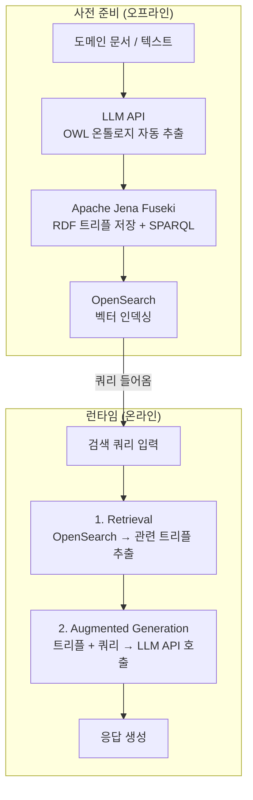
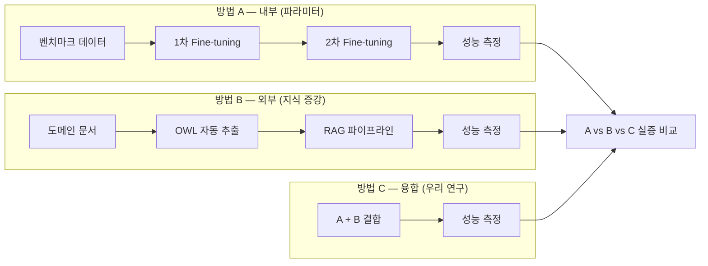

# Alltology

> AWS가 상용 인프라로 검증한 OWL 기반 지식 파이프라인을 오픈소스로 재현하고,
> Fine-tuning과 결합하여 **융합 방법론의 유효성을 실증적으로 검증한다**

<br/>

## 🧭 프로젝트 개요

LLM의 할루시네이션 문제를 해결하는 두 가지 접근—**파라미터 학습(Fine-tuning)** 과 **외부 지식 증강(RAG)**—을 동일한 벤치마크 위에서 실증 비교하고, 융합했을 때 시너지가 발생하는지 검증합니다.

AWS가 상용 인프라로 구현한 OWL 기반 파이프라인을 오픈소스 스택으로 재현하고, **LLM API 기반 온톨로지 자동 추출**을 추가해 자동화한 것이 본 연구의 핵심 기여입니다.

<br/>

## 🚨 문제

LLM은 강력하지만, **학습 시점 이후의 지식**이나 **도메인 특화 정보**에서는 한계가 있습니다.
이를 해결하는 방식은 두 갈래로 나뉩니다.

|  | 방식 | 한계 |
|---|---|---|
| 내부 접근 | 모델을 직접 학습시킨다 (Fine-tuning) | 비용이 크고, 학습한 것을 잊는다 |
| 외부 접근 | 필요한 지식을 찾아서 넣어준다 (RAG) | 추론 일관성의 한계 |

**어느 쪽이 더 나은지, 합치면 더 좋아지는지 — 체계적으로 비교하고 융합한 연구는 아직 충분하지 않습니다.**

<br/>

## 💡 솔루션



<br/>

## 🤖 기술 파이프라인



<br/>

## 🧪 실험 설계



### 핵심 연구 질문

1. Fine-tuning과 RAG 중 어느 쪽이 할루시네이션 감소에 더 효과적인가?
2. 두 기법을 융합했을 때 성능이 단순 합산 이상으로 향상되는가?
3. 도메인 특성(미디어)에 따라 최적 전략이 달라지는가?

<br/>

## 📊 AWS 원본 vs 우리 구현

| AWS 원본 | 우리 (오픈소스) | 비고 |
|---|---|---|
| 수동 OWL 설계 | LLM API 자동 추출 | **추가 기여** |
| Amazon Neptune | Apache Jena Fuseki | 무료 오픈소스 |
| 상용 검색 인프라 | OpenSearch | 무료 오픈소스 |
| 상용 LLM | LLM API | 오픈소스 모델 |
| 상용 Fine-tuning | LoRA / PEFT | 무료 오픈소스 |

<br/>

## 📚 Related Work

| 연구 | 방법 | 한계 |
|---|---|---|
| LoRA (Hu et al., 2022) | 파라미터 효율적 Fine-tuning | 외부 지식 구조 미반영 |
| RAG (Lewis et al., 2020) | 비구조적 문서 검색 증강 | 온톨로지 논리 추론 불가 |
| LLMs4OL (Babaei et al., 2023) | LLM 기반 온톨로지 자동 학습 | Fine-tuning과의 융합 미검증 |
| OntoTune (WWW 2025) | 온톨로지 기반 LLM self-training | 파라미터 학습과 분리된 접근 |
| GraphGen (2025) | KG → Fine-tuning 데이터 자동 생성 | 온톨로지 구조적 추론 미활용 |
| AWS Neptune + OWL (2022) | 상용 인프라 기반 OWL 파이프라인 | LLM 증강 · Fine-tuning 미결합 |

**본 연구의 기여:** 오픈소스 스택으로 파이프라인을 재현하고, 내부 / 외부 / 융합 세 방식을 벤치마크 기반으로 실증 비교하여 융합 방법론의 유효성을 검증합니다.

<br/>

## 🛠 기술 스택

### AI / 학습

| 역할 | 기술 |
|------|------|
| Fine-tuning |  |
| Alignment |  |
| 개발 환경 |   |
| Testing |  |

### 지식 증강 (RAG / 온톨로지)

| 역할 | 기술 |
|------|------|
| 온톨로지 저장 |  |
| 벡터 검색 |  |
| OWL 추출 |  |

### 평가

| 역할 | 기술 |
|------|------|
| 자동 평가 |  |
| 정성 평가 |  |

### 공통

| 역할 | 기술 |
|------|------|
| 버전 관리 |   |

<br/>


| 모듈 | 실행 | 테스트 |
|:--:|:--|:--|
| **Ontology** | `python ontology/extract.py` | `pytest ontology/` |
| **RAG** | `python rag/pipeline.py` | `pytest rag/` |
| **Fine-tuning** | `python finetuning/train.py` | `pytest finetuning/` |
| **Eval** | `python eval/run_eval.py` | `pytest eval/` |
| **전체 테스트** | | `pytest` |

<br/>

## 📁 저장소 구조

```text
Graduation-Project/
├── data/          # 실증적 비교 연구를 위한 벤치마크 및 데이터셋
├── doc/           # 프로젝트 관련 연구 문서 및 상세 가이드
├── eval/          # 성능 평가 체계 (RAGAS, LLM-as-a-judge 등)
├── finetuning/    # 모델 최적화 (LoRA/QLoRA) 및 학습 스크립트
├── rag/           # RAG 파이프라인 (Chunking, Retrieval, Generation)
├── results/       # 실험 결과 리포트 및 최종 성능 지표
├── .env.example   # 환경 변수 설정을 위한 샘플 파일
├── CNAME          # 커스텀 도메인 연결 설정 파일
├── index.html     # 프로젝트 홍보 및 안내용 웹 페이지
├── README.md      # 프로젝트 개요 및 통합 안내 문서
├── CLAUDE.md      # 클로드 프로젝트 문서 정리 가이드
└── requirements.txt # 프로젝트 실행을 위한 의존성 패키지 목록

```

### 처음 보는 사람을 위한 읽는 순서

1. `doc/`에서 연구 설계 문서로 전체 방향을 파악한다.
2. `ontology/`에서 OWL 자동 추출 로직을 확인한다.
3. `rag/`에서 RAG 파이프라인 구조를 확인한다.
4. `finetuning/`에서 LoRA 파인튜닝 설정을 확인한다.
5. `eval/`을 실행해 방법 A / B / C의 성능 지표를 비교한다.

<br/>

## 🌿 브랜치 전략

```
main ← 최종 제출 / 논문 기준
 └── dev ← 통합 개발 (PR 타겟)
      ├── feat/ontology/#이슈번호-설명
      ├── feat/rag/#이슈번호-설명
      ├── feat/finetuning/#이슈번호-설명
      └── fix/#이슈번호-설명
```

<br/>

## 👥 팀

**팀명:** Alltology · **트랙:** 연구 · **지도교수:** 황의원 교수님

|  |  |  |
|:--:|:--:|:--:|
| **박세령** | **손현경** | **이다영** |
| 온톨로지 설계 · RAG 파이프라인 | AI 엔진 · 파인튜닝 (LoRA/QLoRA) | 개발 · 데이터 파이프라인 |
| [@ryeong03](https://github.com/ryeong03) | [@bbberylll](https://github.com/bbberylll) | [@dev-ldy03](https://github.com/dev-ldy03) |

<br/>

<div align="center">
<sub>이화여자대학교 졸업프로젝트 2026</sub>
</div>
