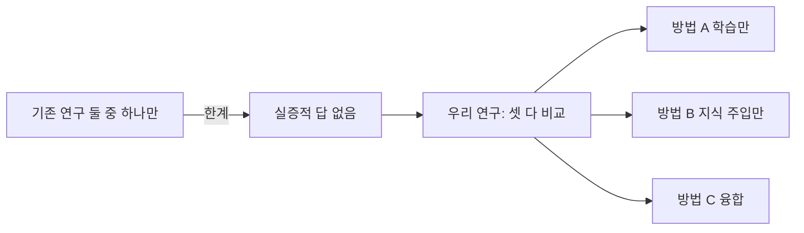
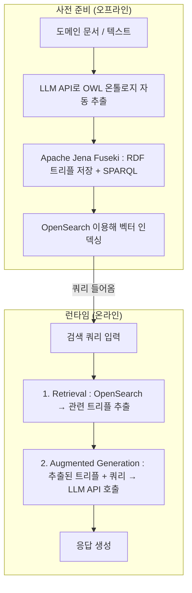
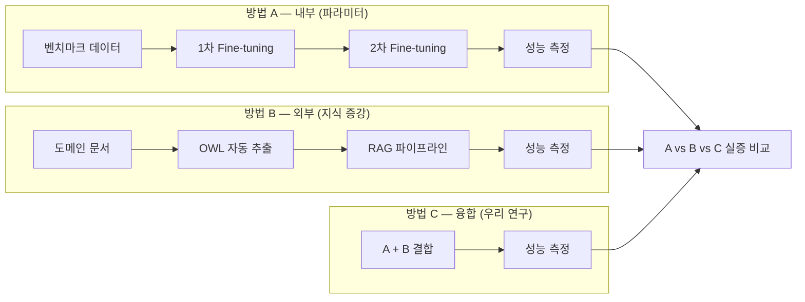

# 일반 벤치마크를 활용한 LLM 내부 파라미터 확장과 온톨로지 기반 지식 증강 기법의 실증적 성능 비교 및 융합 방법론 연구

> 부제: 단계적 Fine-tuning과 온톨로지 기반 외부 지식 검색의 결합(RAG)이 LLM 성능에 미치는 영향

---

## 발표 스크립트 (100초)

> **[두괄식 오프닝]**
> "저희는 AI 모델을 두 단계로 학습시키고, 온톨로지 기반 외부 지식 검색까지 결합했을 때 LLM이 얼마나 더 정확해지는지를 실험으로 증명합니다."

**① 문제 (20초)**
LLM은 강력하지만 특정 도메인에서는 틀린 답을 자신 있게 말하는 문제가 있습니다. 이를 해결하는 방식은 모델을 직접 학습시키는 내부 접근과, 외부에서 지식을 찾아 넣어주는 외부 접근으로 나뉩니다. 그런데 어느 쪽이 더 나은지, 합치면 더 좋아지는지에 대한 실증적 답이 아직 없습니다.

**② 해결 아이디어 (20초)**
저희는 내부 접근(단계적 Fine-tuning)과 외부 접근(온톨로지 기반 RAG)을 각각 단독으로, 그리고 융합해서 동일한 벤치마크로 비교합니다. AWS가 상용 인프라로 구현한 파이프라인을 오픈소스로 재현하고, 온톨로지 자동 추출을 추가해 누구나 쓸 수 있게 만듭니다.

**③ 기술/구현 (30초)**
사전 준비 단계에서는 도메인 문서를 LLM API로 OWL 온톨로지로 자동 변환하고, Apache Jena Fuseki에 RDF 트리플로 저장한 뒤 OpenSearch로 벡터 인덱싱합니다. 런타임에서는 질문이 들어오면 OpenSearch가 관련 트리플을 추출하고 LLM이 이를 참고해 답변을 생성합니다. Fine-tuning은 LoRA 기반으로 1차 SFT, 2차 DPO 순서로 진행합니다.

**④ MVP/배포 (20초)**
최종 산출물은 세 가지입니다. 단독 Fine-tuning, 단독 RAG, 융합 모델의 성능을 비교한 실험 결과 논문, 전체 파이프라인 코드의 GitHub 공개, 그리고 벤치마크 결과 테이블과 케이스 스터디입니다.

**⑤ 차별성 (10초)**
기존 연구는 Fine-tuning 또는 RAG 중 하나만 다룹니다. 저희는 온톨로지 구조화 검색과 단계적 Fine-tuning을 융합한 파이프라인을 오픈소스로 구현하고 세 방식을 동시에 실증 비교하는 첫 번째 연구입니다.

---

## 문제

LLM은 강력하지만, 특정 도메인에서는 **틀린 답을 자신 있게 말한다**

이를 해결하는 방식은 두 갈래로 나뉜다

| | 방식 | 한계 |
|---|---|---|
| 내부 접근 | 모델을 직접 학습시킨다 (Fine-tuning) | 비용이 크고, 학습한 것을 잊는다 |
| 외부 접근 | 필요한 지식을 찾아서 넣어준다 (RAG) | 추론 일관성의 한계 |

**어느 쪽이 더 나은지, 합치면 더 좋아지는지 — 실증적 답이 없다**

---

## 해결 아이디어

AWS가 상용 인프라로 구현한 파이프라인을 참고하되
**누구나 쓸 수 있는 오픈소스로 재현**하고, **온톨로지 자동 추출**을 추가해 자동화한다

---

## 기술 파이프라인

---

## 실험 설계

---

## MVP / 배포

연구 트랙 산출물은 세 가지로 구성된다

| 산출물 | 내용 |
|---|---|
| **실험 결과 논문** | 방법 A / B / C 성능 비교표 + 케이스 스터디 |
| **GitHub 공개 코드** | 전체 파이프라인 오픈소스 공개 (Apache Jena + OpenSearch + LoRA) |
| **벤치마크 재현 패키지** | 동일 환경에서 누구나 실험을 재현할 수 있는 스크립트 |

실험 환경은 RTX 3090 × 4 기준이며, QLoRA 적용으로 일반 연구실 수준에서도 재현 가능하도록 설계한다

---

## 차별성

기존 연구는 Fine-tuning 또는 RAG 중 하나만 다루거나, 온톨로지 없는 일반 지식 조건에서 비교한다

본 연구는 **온톨로지 구조화 검색 + 단계적 Fine-tuning 융합**을 오픈소스로 구현하고 세 방식을 동일 벤치마크에서 동시에 실증 비교하는 첫 번째 시도다

---

## AWS 버전 vs 본 연구

| AWS 버전 | 본 연구 (오픈소스) | 비고 |
|---|---|---|
| 수동 OWL 설계 | **LLM API 자동 추출** | 추가 기여 |
| Amazon Neptune | Apache Jena Fuseki | 무료 오픈소스 |
| 상용 검색 인프라 | OpenSearch | 무료 오픈소스 |
| 상용 LLM | LLM API | 오픈소스 모델 |
| 상용 Fine-tuning | LoRA / PEFT | 무료 오픈소스 |

---

## Related Work

| 연구 | 방법 | 한계 |
|---|---|---|
| PA-RAG (NAACL 2025) | RAG의 정보성·강건성·인용 품질을 위해 SFT와 DPO를 순차 적용하는 멀티스테이지 학습 | Full Fine-tuning 중심이라 비용·규모 부담이 크고, 온톨로지·구조화 지식 파이프라인과의 융합 실증은 다루지 않음 |
| ClashEval (2024) | Parametric(내부) 지식과 Contextual(검색) 문서가 충돌할 때 모델 반응을 유형별로 실험·측정 | Knowledge Conflict의 현상 분석에 초점; 해결 방법론이나 내부·외부·융합 세 방식의 체계적 비교는 아님 |
| DPA-RAG (WWW 2025) | Retriever–Generator 간 선호 간극을 줄이기 위한 Dual Alignment(SFT, reranker 정렬 + pre-aligned 단계) | 검색–생성 정렬에 집중; OWL 온톨로지 기반 지식 증강과 LoRA 등 경량 파인튜닝을 결합한 파이프라인 실증과는 초점이 다름 |

**본 연구의 기여**
오픈소스 스택으로 파이프라인을 재현하고, 내부 / 외부 / 융합 세 방식을 벤치마크 기반으로 실증 비교하여 융합 방법론의 유효성을 검증한다

---

## 차별성 · 독특성 · 우수성 근거

### 차별성

| 항목 | 기존 연구 | 본 연구 |
|---|---|---|
| 비교 방식 | Fine-tuning 또는 RAG 단독 | 단독 + 융합 세 방식 동시 비교 |
| 온톨로지 활용 | 없거나 수동 구축 | LLM API로 OWL 자동 추출 |
| 파인튜닝 방식 | Full Fine-tuning 위주 | LoRA/QLoRA 경량화 (RTX 3090 재현 가능) |
| 인프라 | 상용 (AWS Neptune 등) | 완전 오픈소스 (Jena + OpenSearch) |

### 독특성

기존 연구가 다루지 않은 **세 가지 조합을 동시에 실험**한다는 점이 본 연구의 핵심 독창성이다. 특히 OWL 온톨로지를 LLM API로 자동 추출하는 파이프라인은 AWS 원본에도 없는 본 연구의 추가 기여다.

### 우수성

- **재현 가능성:** QLoRA 적용으로 학부 연구실 수준(RTX 3090 × 4)에서 전체 실험 재현 가능
- **실용성:** 오픈소스 스택 전체 공개로 후속 연구 진입 장벽을 낮춤
- **실증성:** 벤치마크 기반 정량 평가 + 케이스 스터디 정성 분석을 병행해 결과의 신뢰도를 높임

