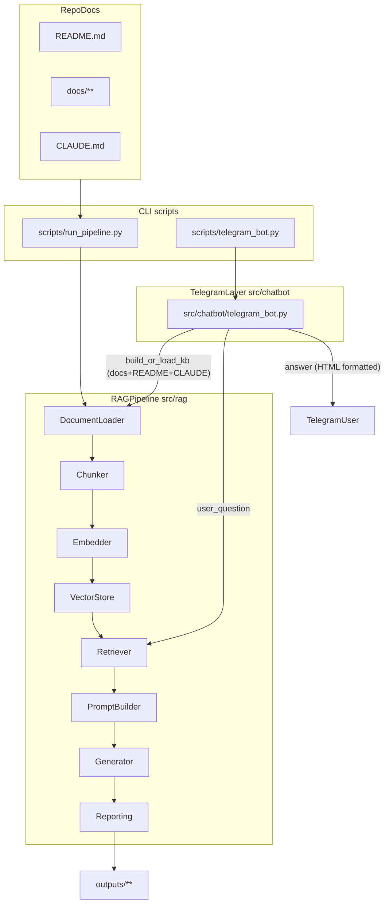

# Architecture (1-page)

> Goal: 외부 방문자가 “무엇이 어디서 어떻게 동작하는지”를 1분 내 파악할 수 있게 하는 요약 문서입니다.  
> Status: **Start-stage implementation.**  
> - `src/rag/`: implemented RAG pipeline for smoke tests and Arm 1·2 pilot comparison  
> - `src/training/`: DPO+LoRA dry-run/scaffold for Growth-stage learning  
> - `src/evaluation/`: metric and 5-arm evaluation harness scaffold; full benchmark deferred

## High-level overview

- **Inputs**: `docs/`, `README.md`, `CLAUDE.md` (repo 문서 지식베이스) 또는 `data/sample_docs/` (smoke test용 샘플 문서)
- **Core pipeline**: Load → Chunk → Embed → Index/Load → Retrieve → Prompt → Generate
- **Outputs**: `outputs/` 아래 실행 산출물(예: run report, saved answers) 및 (옵션) 인덱스 폴더

## Data flow

## Key entrypoints

- **RAG CLI**: `scripts/run_pipeline.py` (config + docs path + question)
- **Core pipeline orchestration**: `src/rag/pipeline.py`
- **Telegram bot**: `scripts/telegram_bot.py` → `src/chatbot/telegram_bot.py`

## Configuration

- **Experiments**: `configs/experiments/*.yaml`
  - retrieval: chunking, embedding model, `retrieval.index_dir` (인덱스 재사용)
  - llm: provider/model
- **Prompts**: `configs/prompts/*.md`

## Notes (evaluation-alignment)

- 본 레포는 Start-stage 산출물임을 README에 명시하며, **Arm 1·2 파일럿 결과**와 **로컬 smoke**는 근거 경로를 함께 제시합니다.
- **측정되지 않은** 5-arm 정량 benchmark·RAGAS 수치·LoRA adapter inference 결과는 주장하지 않습니다.
- “정합성” 점검을 위해 RQ ↔ 구현 링크는 `docs/rq_to_implementation_map.md`에 유지합니다.
