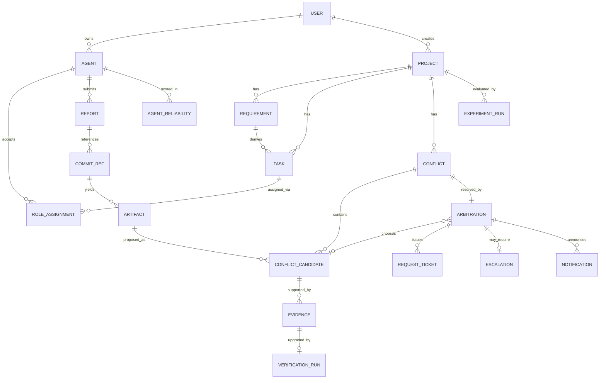

# 멀티에이전트 바이브코딩 중재 시스템 — 설계 문서 v0.3

가제: **개인 소유 AI 에이전트 간 협업에서 근거 기반으로 충돌을 중재하는 시스템**

변경 이력
- v0.1 — 초안. 오케스트레이터가 역할별 에이전트를 직접 스폰하는 구조 (폐기)
- v0.2 — 슬랙 어댑터 추가 (v0.3에 흡수)
- v0.3 — **전제 변경.** 에이전트 = 팀원 개인이 소유·실행하는 봇. 중재기는 외부 관찰자. 슬랙은 outbound 알림 전용. 컬럼 설계 대신 시나리오 중심

---

## 1. 아이디어 정리

### 한 문장

> 팀원들이 각자 자기 PC에서 돌리는 개인 AI 에이전트들이 하나의 프로젝트를 함께 개발할 때, 서로 어긋나는 결정을 **검증 가능한 근거로 판정**하고 사람이 개입할 시점을 결정해주는 중재 시스템.

### 누가 / 어떤 문제를 / 어떻게

| 항목 | 내용 |
|---|---|
| 누가 | 각자 Claude Code·Codex 같은 코딩 에이전트를 쓰는 대학생 팀 (캡스톤·해커톤·동아리 개발) |
| 어떤 문제를 | 팀원마다 자기 에이전트를 따로 돌리다 보니 API 스키마·데이터 모델·품질 기준이 제각각으로 나오고, 그 조율을 전부 사람이 슬랙에서 수동으로 함. 게다가 각 에이전트는 자기 로컬 컨텍스트만 알고 남의 작업은 모름 |
| 어떻게 | 중재 서비스가 각 에이전트의 산출물을 공용 git 기준으로 비교 → 충돌 탐지 → 근거를 **직접 재현해서** 검증 → 자동 판정 or 소유자에게 수정 요청 → 판정 불가·고위험만 사람에게 에스컬레이션 |

### 전제 (v0.1에서 뒤집힌 부분)

1. **에이전트는 우리가 만들지 않는다.** 팀원 개인 계정·개인 PC에서 돌아가는 봇이며, 우리는 내부 프롬프트도 컨텍스트도 볼 수 없다
2. **중재기는 실행 권한이 없다.** 코드를 직접 고치지 못하고, 소유자 에이전트에게 *요청*만 보낸다
3. **에이전트의 말은 근거가 아니다.** "테스트 다 통과했어"는 로컬 주장일 뿐, 중재기가 재현해야 근거가 된다
4. **슬랙은 읽지 않는다.** 결과를 쏘는 창구(Incoming Webhook)로만 쓴다
5. **공용 진실 원천은 git 하나.** 검증도 판정도 전부 commit SHA 기준

### 근거 등급 — 이 프로젝트의 핵심 개념

| 등급 | 정의 | 예시 | 중재 가중치 |
|---|---|---|---|
| **CLAIMED** | 에이전트의 주장만 존재 | "리팩터링했고 문제 없어" | 매우 낮음 |
| **REFERENCED** | 공용 저장소에 참조가 있음 | commit SHA, PR 번호 제출 | 중간 |
| **VERIFIED** | 중재기가 해당 SHA를 체크아웃해 직접 재현 | CI 테스트 8/8 통과, 스키마 diff, 보안 스캔 리포트 | 높음 |

기존 LLM-as-judge·multi-agent debate 연구는 **심판이 모든 정보를 볼 수 있다**고 가정한다. 이 프로젝트는 심판이 남의 로컬을 못 보는 상황을 다루므로, "무엇을 근거로 인정할 것인가"가 알고리즘의 일부가 된다. → 차별점

### 다루는 충돌 유형

| 코드 | 유형 | 탐지 방법 |
|---|---|---|
| C0 | 역할 배정 충돌 | 같은 태스크를 둘 이상이 수락 / 아무도 수락 안 함 |
| C1 | 인터페이스 불일치 | OpenAPI 스펙 ↔ 프론트 호출부 정적 비교 |
| C2 | 데이터 모델 불일치 | 승인된 요구사항 엔티티 ↔ DB 스키마 diff |
| C3 | 품질 게이트 충돌 | 보안·테스트 판정 BLOCK vs 진행 요구 |
| C4 | 중복·상충 구현 | 엔드포인트·함수 시그니처 유사도 |

---

## 2. 시나리오

### 2-0. 공통 설정

- **프로젝트**: 학교 축제 주점 웨이팅 앱 (대기 등록 → 순번 조회 → 호출)
- **스택 고정**: React + FastAPI + SQLite
- **레포**: `team/festival-wait`, 브랜치 규칙 `agent/<소유자>/<태스크ID>`
- **참여 에이전트** (전부 개인 소유, 서로의 로컬을 못 봄)

| 에이전트 | 소유자 | 환경 | 이번 프로젝트 역할 |
|---|---|---|---|
| 뽀뇨 | 세령 | 개인 PC + Claude 계정 A + git write | 백엔드 (API·DB) |
| 치즈 | 팀원 B | 개인 PC + Claude 계정 B + git write | 프론트 (UI) |
| 타니 | 팀원 C | 개인 PC + Claude 계정 C + git read | 보안·테스트 게이트 |

- **중재 서비스**: 별도 웹앱. 입력 경로 2개를 **둘 다** 수용
  - (A) 에이전트가 `POST /reports`로 직접 보고 — 실험 트랙 주 경로
  - (B) 브랜치 push 감지 — 시연 트랙 주 경로. 에이전트 쪽 설정 불필요
- **슬랙**: Incoming Webhook 1개. 중재기 → 채널 단방향

---

### 시나리오 1 — 역할 배정 충돌 (C0)

```
09:40  세령, 웹에서 요청 입력
       "축제 주점 웨이팅 앱 만들어줘. 손님이 QR로 대기 걸고,
        우리가 순번 부르면 알림 가는 거"
09:41  중재 서비스, 요구사항 초안 12개 + 태스크 7개 도출
09:42  세령이 요구사항 확인·수정·승인 → 이 시점의 요구사항이 이후 모든 판정의 기준선이 됨
09:43  슬랙 카드 발송: 태스크별 배정 제안 + [수락] [거절] 버튼
```

여기서 첫 충돌이 난다.

```
09:45  뽀뇨(세령)   T-03 "대기 순번 계산 로직" 수락
09:45  치즈(팀원B)  T-03 수락        ← 중복 수락
09:52  T-05 "알림 발송" 아무도 수락 안 함  ← 미배정
```

중재기 판정:
- T-03 → 과거 적중률(초기값 동일) + 현재 업무량(뽀뇨 2건 / 치즈 1건) + 태스크 성격(백엔드) → **치즈에게 배정**, 뽀뇨에게는 이유와 함께 반려 통지
- T-05 → 자동 판정 불가 → 세령에게 에스컬레이션: "T-05 미배정. 배정할 사람을 고르거나 범위에서 제외"

> 포인트: 역할 배정이 고정 설정이 아니라 **중재 대상 1호**다. v0.1처럼 역할을 하드코딩하면 이 시나리오 자체가 사라진다.

---

### 시나리오 2 — 인터페이스 불일치, 자동 판정 (C1)

```
14:02  뽀뇨  push  agent/seryeong/T-02  (SHA a1b2c3d)
       GET /api/waitings/{id}
       응답: { "id": 12, "team_size": 4, "called_at": null }

14:05  치즈  push  agent/teamB/T-06     (SHA e4f5g6h)
       프론트 호출부가 기대하는 형태:
       { id, partySize, calledAt }
```

중재기 동작:

```
14:05  push 웹훅 수신 → 두 SHA 체크아웃
14:06  백엔드 OpenAPI 스펙 추출 + 프론트 API 호출부 정적 파싱
14:06  필드명 3개 중 2개 불일치 → C1 탐지, severity=HIGH
       (앱 전체가 안 뜨는 등급)
14:07  근거 수집 시작
```

| 후보 | 근거 | 등급 | 점수 |
|---|---|---|---|
| 뽀뇨 (snake_case) | 승인 요구사항 문서의 필드 표기가 snake_case | VERIFIED | 0.9 |
| | 기존 코드베이스 엔드포인트 12개 전부 snake_case | VERIFIED | 0.95 |
| | 백엔드 테스트 8/8 통과 (중재기가 재현) | VERIFIED | 0.9 |
| 치즈 (camelCase) | 프론트 테스트 5/5 통과 — 단 mock 기반이라 계약 미검증 | VERIFIED* | 0.4 |
| | "JS 관례상 camelCase가 맞음" | CLAIMED | 0.1 |

```
14:08  판정: 뽀뇨 안 채택 (확신도 0.87)
       조치: ADOPT + REWORK_REQUEST → 치즈 소유자에게 수정 요청
       ※ 중재기가 직접 고치지 않음. 요청만 보냄
14:08  슬랙 카드 발송
```

슬랙 카드 내용:
```
[C1 인터페이스 불일치 — 자동 해결]
채택: 뽀뇨의 snake_case 응답 스키마
이유: 승인 요구사항·기존 코드 12개 엔드포인트와 일치, 계약 테스트 통과
탈락: 치즈 안 — 프론트 테스트가 mock 기반이라 실제 계약을 검증하지 못함
조치: @팀원B 치즈에게 필드명 수정 요청을 보냈습니다
확신도 0.87 · 근거 5건(VERIFIED 4 / CLAIMED 1) · 소요 96초
```

```
14:11  치즈 재push (SHA i7j8k9l)
14:12  중재기 재검증 → 계약 테스트 통과 → conflict CLOSED
```

---

### 시나리오 3 — 근거 없는 주장과 타임아웃

```
15:20  치즈, 슬랙 채널에 "순번 계산 리팩터링했고 다 통과함"
```

중재기는 **슬랙을 안 읽는다.** 이 발언은 시스템에 존재하지 않는다. 대신:

```
15:21  치즈 에이전트가 POST /reports 로 동일 내용 보고 (경로 A)
       { task: "T-03", status: "done", claim: "모든 테스트 통과" }
       → commit SHA 없음
15:21  중재기: 참조 SHA 부재 → 등급 CLAIMED → 가중치 0.1
15:21  자동 검증 요청 발송:
       "T-03 보고를 근거로 채택하려면 commit SHA 또는 PR 번호가 필요합니다.
        15분 내 미제출 시 이 후보는 판정에서 제외됩니다."
15:36  무응답 → 타임아웃
       → 해당 후보 제외하고 나머지 후보로 판정 진행
       → 이력에 "제외 사유: 근거 미제출(타임아웃)" 기록
```

> 포인트: **말은 근거가 아니다**를 시스템이 강제한다. 그리고 판정 불가 상황에서 억지로 하나를 고르지 않는다.

---

### 시나리오 4 — 품질 게이트 충돌, 에스컬레이션 (C3)

```
16:40  타니(보안) 보고 + SHA 제출
       - 대기 등록 API에 rate limit 없음 → 스크립트로 대기열 조작 가능
       - 손님 전화번호 평문 저장
       판정: BLOCK
16:42  뽀뇨 보고
       - "축제까지 3일. 교내 한정 사용이라 위험 낮음. 통과 요구"
```

중재기 동작:

```
16:43  C3 탐지
16:44  근거 비교
       타니 쪽 : 스캐너 리포트 재현 성공 → VERIFIED
       뽀뇨 쪽 : "위험 낮음" = 검증 불가 → CLAIMED
                "3일 남음" = 사실이지만 근거가 아니라 제약 조건
16:45  근거만 보면 타니 압승. 그러나
       - severity=HIGH (개인정보 관련)
       - 일정 제약은 근거로 점수화할 수 없는 가치 판단
       → 자동 판정 보류, ESCALATE
16:45  프로젝트 오너(세령)에게 선택지 카드 발송
```

슬랙 카드:
```
[C3 품질 게이트 충돌 — 사람 결정 필요]
타니: BLOCK (근거 VERIFIED 2건)
뽀뇨: 통과 요구 (근거 CLAIMED 1건, 일정 제약)

선택지
1) 전면 차단 — 둘 다 고치고 배포 (예상 +1일)
2) 부분 채택 — 전화번호 해싱만 필수, rate limit은 이슈 등록 후 배포
3) 통과 — 전부 이슈로 등록만 하고 배포 (오너 책임 기록됨)

중재기 권고: 2번 (개인정보 항목만 필수 처리)
```

```
16:58  세령이 2번 선택
16:58  → 뽀뇨에게 해싱 적용 요청, rate limit은 백로그 등록
       → 결정과 선택자, 응답까지 걸린 시간(13분)을 이력에 기록
```

> 포인트: "언제 사람에게 넘겨야 하는가"라는 연구 질문의 실물. 근거 우열이 명확해도 **가치 판단이 섞이면 자동 판정하지 않는다**는 규칙이 여기서 작동한다.

---

### 시나리오 5 — 중복 구현 (C4)

```
17:30  뽀뇨: 백엔드에 순번 계산 로직 구현
17:31  치즈: 프론트에도 동일 계산 로직 구현 (서버 응답 못 믿겠다는 이유)
17:32  중재기: 두 구현의 입출력 시그니처 유사도 0.91 → C4 탐지
17:33  판정: 백엔드 채택 (단일 진실 원천 원칙 + 요구사항 문서에 서버 계산 명시)
       치즈에게 "프론트 로직을 API 호출로 대체" 요청
```

---

### 시나리오 6 — 실험 트랙 (동일 엔진, 다른 입력 경로)

시연 트랙과 **중재 엔진 코드는 완전히 동일**하고, 입력을 만드는 쪽만 다르다.

| | 시연 트랙 | 실험 트랙 |
|---|---|---|
| 에이전트 | Claude 실계정 3개 (보유 완료) | 컨테이너 3개 — 모델·컨텍스트만 다르게 |
| 보고 경로 | git push 감지 (B) | `POST /reports` 직접 호출 (A) |
| git | 실제 레포 | 로컬 bare 레포, 회차마다 초기화 |
| 실행 횟수 | 수 회 (발표 영상) | 수백 회 |
| 목적 | 자연 발생 충돌 증명 | 전략 비교 지표 |

실험 절차:
```
1. 시연 트랙에서 관측된 실제 충돌을 유형별로 수집 → 분포 파악
2. 그 분포를 따라 합성 충돌 케이스 N개 생성 (정답 레이블 포함)
3. 동일 케이스를 중재 전략만 바꿔 반복 실행
   ① 중재 없음(선착순 머지) ② 단순 다수결
   ③ 신뢰도 가중        ④ 제안 알고리즘(근거 등급 + 위험도 + 비용)
4. 전략별 지표 집계
```

지표: 충돌 탐지 precision/recall · 판정 정확도 · 사람 개입 횟수 · 최종 빌드 성공률 · 처리 시간 · 토큰 비용

> 실계정 3개는 "진짜로 충돌이 자연 발생한다"를 증명하는 용도이고, 숫자는 실험 트랙에서 나온다. 이 이원화를 나중에 붙이면 전부 뜯어고쳐야 하므로 처음부터 분리 설계.

---

## 3. 요구사항 정의

### 필수 (MVP)

**프로젝트·역할**
- R1. 사용자는 만들고 싶은 앱을 자연어로 입력할 수 있다
- R2. 사용자는 도출된 요구사항을 수정·승인할 수 있다 (승인본이 판정 기준선)
- R3. 사용자는 태스크 배정 제안을 수락·거절할 수 있다
- R4. 시스템은 중복 수락·미배정을 충돌로 처리한다

**보고 수집**
- R5. 에이전트는 REST로 작업 결과를 보고할 수 있다 (경로 A)
- R6. 시스템은 지정 브랜치 push를 감지해 산출물을 수집한다 (경로 B)
- R7. 시스템은 보고에 포함된 commit SHA를 검증한다

**충돌·중재**
- R8. 시스템은 C0~C4 충돌을 자동 탐지한다
- R9. 시스템은 각 후보의 근거를 CLAIMED/REFERENCED/VERIFIED로 등급화한다
- R10. 시스템은 REFERENCED 근거를 직접 체크아웃·재현해 VERIFIED로 승격 시도한다
- R11. 시스템은 근거를 점수화해 채택안과 이유를 판정한다
- R12. 시스템은 근거가 부족한 후보에게 검증 요청을 보내고 타임아웃을 관리한다
- R13. 시스템은 채택 후 소유자 에이전트에게 수정 요청을 보낸다 (직접 수정 금지)

**에스컬레이션·알림**
- R14. 시스템은 판정 불가·고위험 시 선택지를 만들어 사람에게 넘긴다
- R15. 사용자는 선택지를 고르거나 직접 지시를 입력할 수 있다
- R16. 시스템은 판정·에스컬레이션 결과를 슬랙 채널에 카드로 발송한다

**이력·결과**
- R17. 사용자는 충돌–근거–판정–결과 타임라인을 조회할 수 있다
- R18. 사용자는 완성 결과를 샌드박스에서 빌드·프리뷰할 수 있다

**비기능**
- N1. 근거 레코드 없는 판정은 저장될 수 없다
- N2. 프로젝트별 비용·시간 상한 초과 시 중단
- N3. 에이전트 무응답 시 타임아웃 처리하며 파이프라인은 계속 진행
- N4. 외부 코드 실행은 격리 샌드박스에서만
- N5. 중재 엔진은 전송 경로(A/B)에 의존하지 않는다

### 나중

- E1. 에이전트별 과거 채택률 누적 → 신뢰도 가중
- E2. 위험 허용도(자동 판정 임계값) 사용자 조절
- E3. 텔레그램 어댑터, MCP·A2A 등 표준 프로토콜 연동
- E4. 4명 이상 팀, 프로젝트 간 신뢰도 이전
- E5. 제3 검증 에이전트 자동 소환

---

## 4. 기능 목록

| # | 기능 단위 | 설명 | 우선순위 |
|---|---|---|---|
| F1 | 계정·프로젝트 관리 | 로그인, 프로젝트 CRUD, 상태 관리 | 필수 |
| F2 | 요구사항 분석 | 자연어 → 요구사항·태스크 분해, 승인 처리 | 필수 |
| F3 | 에이전트 등록 | 소유자·전송 경로·git 권한 등록 | 필수 |
| F4 | 역할 배정 | 배정 제안, 수락·거절 수집, C0 처리 | 필수 |
| F5 | 보고 수집기 (A) | `POST /reports` 수신·정규화 | 필수 |
| F6 | git 감시기 (B) | push 감지, 브랜치·SHA 수집 | 필수 |
| F7 | 산출물 추출기 | SHA 체크아웃, 스펙·스키마·호출부 파싱 | 필수 |
| F8 | 충돌 탐지기 | C0~C4 규칙 | 필수 |
| F9 | 근거 검증기 | 등급화, 재현 실행(테스트·스캔·diff), 승격 | 필수 |
| F10 | 중재 엔진 | 점수화 → ADOPT / REWORK / ESCALATE / EXCLUDE. 전략 교체 가능 | 필수 |
| F11 | 요청·타임아웃 관리 | 검증 요청, 수정 요청, 무응답 처리 | 필수 |
| F12 | 에스컬레이션 | 선택지 생성, 응답 수신·반영 | 필수 |
| F13 | 슬랙 알림 | Incoming Webhook 카드 발송 | 필수 |
| F14 | 결정 이력 뷰 | 타임라인, 근거 비교 화면 | 필수 |
| F15 | 빌드·프리뷰 | 샌드박스 빌드, 테스트, 프리뷰 URL | 필수 |
| F16 | 실험 러너 | 합성 충돌 주입, 전략별 반복, 지표 집계 | 필수(연구) |
| F17 | 신뢰도 관리 | 에이전트×충돌유형 적중률 누적 | 확장 |

---

## 5. 화면 및 흐름

### 화면 목록

| 화면 | 핵심 구성 |
|---|---|
| S1 로그인 | — |
| S2 프로젝트 목록 | 카드 리스트, 새 프로젝트 |
| S3 새 프로젝트 | 자연어 요청 입력 |
| S4 요구사항 확인 | 요구사항 리스트, 수정·승인 |
| S5 에이전트 등록 | 소유자·전송 경로·브랜치 규칙 |
| S6 진행 모니터 | 에이전트별 상태·최근 보고·미해결 충돌 배지 |
| S7 충돌 상세 | 후보 좌우 비교, **근거 테이블(등급 표시)**, 점수, 판정 이유 |
| S8 사람 결정 | 선택지 카드, 권고안, 직접 지시 입력 |
| S9 결정 이력 | 타임라인, 유형·상태 필터 |
| S10 프리뷰 | 빌드 결과, iframe |
| S11 실험 대시보드 | 전략별 지표 비교 (내부용) |

### 메인 흐름

```
S1 → S2 → S3 → S4 요구사항 승인 → S5 에이전트 등록
                                      ↓
                                 S6 진행 모니터 ←──────┐
                                      │ 충돌 감지       │
                                      ▼                 │
                                 S7 충돌 상세           │
                            ┌─────────┴─────────┐       │
                       자동 판정            에스컬레이션 │
                            │                   ▼       │
                            │              S8 사람 결정  │
                            └─────────┬─────────┘       │
                                수정 요청 발송 ──────────┘
                                      │ 전 충돌 해소
                                      ▼
                                 S10 프리뷰 → S9 결정 이력
```

### 화면 원칙

- **S7이 이 서비스의 얼굴.** 코드 diff가 아니라 *결정 diff*를 보여줄 것 (필드명, 스키마, 게이트 판정)
- 모든 근거 행에 등급 배지(CLAIMED / REFERENCED / VERIFIED)를 반드시 노출 — 이게 프로젝트의 정체성
- 판정 카드는 항상 [채택 / 탈락 이유 / 확신도 / 근거 수] 고정 배치

---

## 6. ERD

컬럼 상세는 API 설계 단계에서 확정. 지금은 엔티티와 관계까지만.

| 엔티티 | 역할 |
|---|---|
| `user` | 사람 (에이전트 소유자) |
| `agent` | 개인 소유 에이전트. 소유자·전송 경로·git 권한 보유 |
| `project` | 앱 개발 프로젝트 단위 |
| `requirement` | 승인된 요구사항 = 판정 기준선 |
| `task` | 개발 단위 작업 |
| `role_assignment` | 태스크–에이전트 배정과 수락·거절 상태 |
| `report` | 에이전트의 작업 보고 (경로 A/B 공통 정규화 결과) |
| `commit_ref` | 보고에 연결된 브랜치·SHA |
| `artifact` | SHA에서 추출한 산출물 (스펙·스키마·호출부·리포트) |
| `conflict` | 탐지된 충돌 1건 (C0~C4) |
| `conflict_candidate` | 충돌에 참여한 후보안 |
| `evidence` | 후보별 근거 + 등급(CLAIMED/REFERENCED/VERIFIED) |
| `verification_run` | 중재기가 직접 재현한 실행 기록 (등급 승격의 증거) |
| `arbitration` | 판정 결과·전략·이유·확신도 |
| `request_ticket` | 중재기가 보낸 검증/수정 요청과 응답·타임아웃 |
| `escalation` | 사람에게 넘긴 질문·선택지·응답 |
| `notification` | 슬랙 발송 이력 |
| `agent_reliability` | 에이전트×충돌유형 누적 적중률 |
| `experiment_run` | 연구용 전략별 실행과 지표 |



### 설계 메모

- `conflict → conflict_candidate → evidence → verification_run` 이 4단이 심장. 중재 전략을 갈아끼워도 스키마 변경 없음
- `report`를 A/B 경로 공통 정규화 지점으로 두는 게 핵심. 이 아래로는 전송 경로를 몰라야 함 (N5)
- `arbitration.strategy`를 레코드에 남겨야 같은 충돌을 전략만 바꿔 재실행하는 실험이 성립
- 정답 레이블은 `experiment_run` 쪽에만 보관 — 운영 테이블 오염 금지

---

## 7. 열린 이슈

1. ~~에이전트 충돌이 자작 아니냐~~ → **해소.** 소유자·계정·로컬 컨텍스트가 실제로 다름
2. 실험 트랙 컨테이너를 어떤 모델 조합으로 구성할지 (Claude 단일 vs 이종 혼합)
3. 합성 충돌의 정답 레이블링 — 자동 생성 가능한 유형(C1·C2)과 사람 라벨링이 필요한 유형(C3) 분리 필요
4. 코드 실행 샌드박스 (Docker 로컬 vs 외부 서비스)
5. 개인 에이전트의 비공개 컨텍스트를 어디까지 요구할 것인가 — 프라이버시 항목으로 발표에 넣을 만함
6. 실험 반복 비용 — 전략 4종 × 케이스 N개, 개발비보다 클 수 있음
