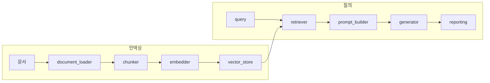

# src/rag/

졸업프로젝트 **RAG baseline** 모듈입니다. 문서를 로드·청킹·임베딩한 뒤 검색하고, 프롬프트에 context를 넣어 답변을 생성합니다. 로컬 HuggingFace와 API(OpenAI 임베딩 / Anthropic 생성)를 YAML로 전환할 수 있으며, conflict-aware 프롬프트는 `configs/prompts/`에서 불러옵니다.

## 파일별 역할

| 파일 | 역할 |
|------|------|
| `pipeline.py` | `RAGPipeline` — 인덱싱·질의 오케스트레이션, `RAGResult` 반환 |
| `config.py` | YAML 실험 설정·경로 해석·`.env` API 키 |
| `document_loader.py` | `.txt` / `.md` / `.json` / `.jsonl` → `Document` |
| `chunker.py` | 문장 경계를 고려한 overlapping 청크 분할 |
| `embedder.py` | SentenceTransformers(로컬) 또는 OpenAI API 임베딩 |
| `vector_store.py` | FAISS(기본) / NumPy 벡터 저장소, 디스크 save·load |
| `retriever.py` | 쿼리 임베딩 + top-k 검색 |
| `prompt_builder.py` | Markdown 프롬프트 템플릿 → chat 메시지 구성 |
| `generator.py` | HuggingFace `Generator` 또는 `AnthropicGenerator` |
| `reporting.py` | 실행 결과를 `outputs/runs/`에 JSON·MD 저장 |
| `github_kb.py` | Telegram 봇용 repo 공개 문서 로드·`grep` |
| `pilot_dataset.py` | batch용 synthetic conflict JSONL 로드 |

## 흐름 (요약)



## 실행

```bash
# 단일 질문 smoke test
python scripts/run_pipeline.py \
  --config configs/experiments/rag_base.yaml \
  --docs data/sample_docs/ \
  --question "What is knowledge conflict in RAG?"

# pilot JSONL batch
python scripts/run_batch.py \
  --config configs/experiments/rag_base.yaml \
  --dataset data/synthetic_conflicts/pilot_conflicts.jsonl
```

설정 예: `configs/experiments/rag_base.yaml`, `prompting_conflict_aware.yaml`, `rag_github_bot.yaml`

## 상태

**구현됨 (1차 초안):** load → chunk → embed → retrieve → generate → report, index 영속화, base/conflict-aware 프롬프트.

**미완:** 벤치마크·최종 eval (`src/evaluation/`), LoRA adapter 로드 (`configs/experiments/lora_*.yaml`는 scaffold). **측정되지 않은 점수는 보고하지 않습니다.**

상세: `docs/architecture.md`, `docs/demo.md`
